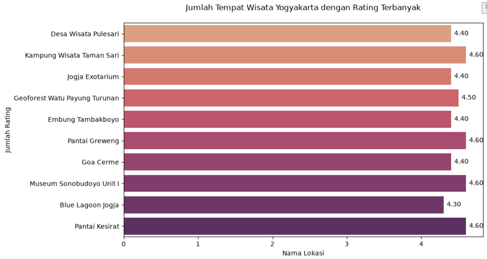
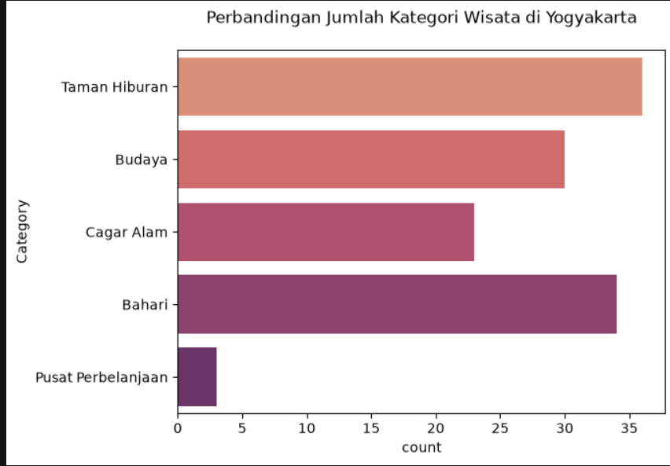
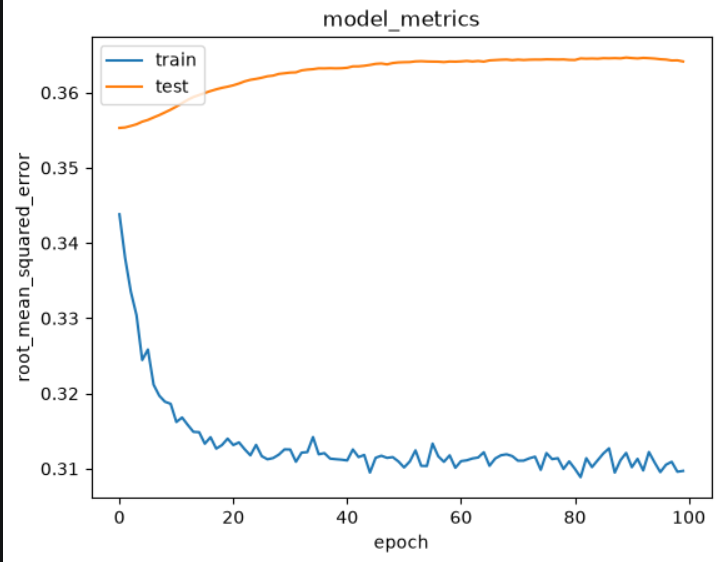

# Laporan Proyek Machine Learning - Febryo Fibonacci Amadeo

## Project Overview

Indonesia, khususnya Daerah Istimewa Yogyakarta, merupakan salah satu destinasi wisata paling populer di Indonesia dengan ragam pilihan yang sangat beragam, mulai dari wisata bahari (pantai), budaya (candi, keraton, museum), cagar alam, taman hiburan, hingga pusat perbelanjaan. Keragaman pilihan ini di satu sisi menjadi kekuatan sektor pariwisata, namun di sisi lain menimbulkan masalah *information overload* bagi wisatawan: semakin banyak pilihan destinasi, semakin sulit bagi wisatawan untuk menentukan tempat yang benar-benar sesuai dengan preferensi mereka dalam waktu terbatas.

Sistem rekomendasi hadir sebagai solusi atas permasalahan tersebut. Sistem ini bekerja dengan menyaring dan mempersempit banyaknya pilihan menjadi beberapa rekomendasi yang paling relevan bagi pengguna, baik berdasarkan kemiripan konten/atribut item (*content-based filtering*) maupun berdasarkan pola preferensi pengguna lain yang serupa (*collaborative filtering*) [1], [2]. Pendekatan berbasis konten memanfaatkan atribut item seperti kategori atau deskripsi untuk mencari item yang mirip dengan item yang disukai pengguna sebelumnya [2], sedangkan pendekatan collaborative filtering memanfaatkan pola interaksi (rating) historis antara banyak pengguna dan item untuk memprediksi preferensi pengguna terhadap item yang belum pernah ia kunjungi [1], [3].

Proyek ini bertujuan membangun sistem rekomendasi destinasi wisata khusus wilayah Yogyakarta dengan memanfaatkan dataset publik **Indonesia Tourism Destination** dari Kaggle, yang berisi data tempat wisata, rating pengguna, dan profil pengguna di lima kota besar di Indonesia (Jakarta, Yogyakarta, Bandung, Semarang, dan Surabaya). Proyek ini penting untuk diselesaikan karena dapat menjadi studi kasus penerapan dua pendekatan rekomendasi yang berbeda pada domain pariwisata lokal, sekaligus memberikan gambaran praktis bagaimana rekomendasi dapat membantu wisatawan menemukan destinasi baru yang relevan dengan cepat.

**Referensi:**
1. Y. Koren, R. Bell, and C. Volinsky, "Matrix Factorization Techniques for Recommender Systems," *Computer*, vol. 42, no. 8, pp. 30–37, 2009.
2. P. Lops, M. de Gemmis, and G. Semeraro, "Content-based Recommender Systems: State of the Art and Trends," in *Recommender Systems Handbook*, Boston, MA: Springer, 2011, pp. 73–105.
3. X. He, L. Liao, H. Zhang, L. Nie, X. Hu, and T.-S. Chua, "Neural Collaborative Filtering," in *Proc. 26th Int. Conf. World Wide Web (WWW '17)*, 2017, pp. 173–182.

## Business Understanding

### Problem Statements

- Bagaimana cara merekomendasikan destinasi wisata di Yogyakarta yang mirip secara karakteristik/kategori dengan destinasi yang sudah disukai atau pernah dikunjungi wisatawan, tanpa memerlukan data interaksi dari pengguna lain?
- Bagaimana cara memanfaatkan riwayat rating dari banyak pengguna untuk memprediksi destinasi wisata di Yogyakarta yang berpotensi disukai oleh seorang pengguna tertentu, berdasarkan pola kesukaan pengguna-pengguna lain yang serupa?

### Goals

- Menghasilkan sistem rekomendasi berbasis **Content-Based Filtering** yang mampu memberikan top-N destinasi wisata di Yogyakarta dengan kategori paling mirip terhadap sebuah destinasi acuan.
- Menghasilkan sistem rekomendasi berbasis **Collaborative Filtering** (model embedding neural network) yang mampu memprediksi rating suatu destinasi wisata di Yogyakarta yang belum pernah dikunjungi oleh seorang pengguna, kemudian menyajikan top-N destinasi dengan prediksi rating tertinggi.

### Solution Statements

Untuk mencapai goals di atas, proyek ini mengajukan dua pendekatan (algoritma) yang berbeda:

1. **Content-Based Filtering dengan TF-IDF dan Cosine Similarity.** Atribut `Category` dari setiap destinasi wisata diubah menjadi representasi vektor menggunakan `TfidfVectorizer`, kemudian tingkat kemiripan antar destinasi dihitung menggunakan *cosine similarity*. Destinasi dengan skor kemiripan tertinggi terhadap destinasi acuan akan direkomendasikan.
   - *Kelebihan:* tidak memerlukan data rating dari pengguna lain (mengatasi *cold-start* pada sisi item/pengguna baru), hasil rekomendasi mudah dijelaskan (*explainable*) karena berbasis kesamaan kategori.
   - *Kekurangan:* rekomendasi cenderung monoton karena hanya mengandalkan satu atribut (kategori) dan berpotensi terjebak pada *overspecialization* (destinasi yang direkomendasikan selalu mirip, kurang variatif).

2. **Collaborative Filtering dengan Neural Network (Embedding).** Dibangun model `RecommenderNet` menggunakan TensorFlow/Keras yang mempelajari representasi laten (embedding) untuk setiap `User_Id` dan `Place_Id` beserta bias masing-masing, lalu memprediksi rating melalui dot product antar embedding user dan place ditambah bias. Model dilatih menggunakan seluruh data rating (skala nasional, bukan hanya Yogyakarta) agar representasi embedding user lebih kaya, kemudian digunakan untuk memprediksi rating destinasi di Yogyakarta yang belum dikunjungi pengguna target.
   - *Kelebihan:* mampu menangkap pola preferensi kompleks antar pengguna yang tidak terlihat dari atribut konten saja, personalisasi lebih tinggi.
   - *Kekurangan:* rentan terhadap *cold-start* untuk pengguna atau destinasi baru yang belum memiliki data rating, serta memerlukan data interaksi yang cukup banyak agar embedding dapat dipelajari dengan baik.

Hasil dari kedua model akan dievaluasi menggunakan metrik yang sesuai dengan karakteristik masing-masing pendekatan (dijelaskan lebih lanjut pada bagian Evaluation), dan keduanya sama-sama menghasilkan output berupa **top-N recommendation**.

## Data Understanding

Dataset yang digunakan pada proyek ini adalah **[Indonesia Tourism Destination](https://www.kaggle.com/datasets/aprabowo/indonesia-tourism-destination)**, yang diunduh langsung dari Kaggle menggunakan pustaka `kagglehub`. Dataset ini terdiri dari 4 berkas CSV:

| Berkas | Jumlah Baris | Jumlah Kolom | Keterangan |
|---|---|---|---|
| `tourism_with_id.csv` | 437 | 10 (setelah pembersihan) | Data 437 destinasi wisata di 5 kota (Jakarta, Yogyakarta, Bandung, Semarang, Surabaya) |
| `tourism_rating.csv` | 10.000 | 3 | Data rating yang diberikan 300 pengguna terhadap destinasi wisata |
| `user.csv` | 300 | 3 | Data profil 300 pengguna |
| `package_tourism.csv` | – | – | Data paket wisata gabungan (dimuat namun tidak digunakan lebih lanjut pada notebook ini) |

Variabel-variabel pada dataset `tourism_with_id.csv` adalah sebagai berikut:
- `Place_Id`: ID unik untuk setiap destinasi wisata.
- `Place_Name`: nama destinasi wisata.
- `Description`: deskripsi singkat mengenai destinasi wisata.
- `Category`: kategori destinasi wisata (mis. Bahari, Budaya, Cagar Alam, Pusat Perbelanjaan, Taman Hiburan).
- `City`: kota tempat destinasi berada.
- `Price`: harga tiket masuk.
- `Rating`: rata-rata rating destinasi (agregat).
- `Coordinate`, `Lat`, `Long`: informasi koordinat lokasi destinasi.

Variabel-variabel pada dataset `tourism_rating.csv`:
- `User_Id`: ID pengguna yang memberikan rating.
- `Place_Id`: ID destinasi wisata yang diberi rating.
- `Place_Ratings`: nilai rating (skala 1–5) yang diberikan pengguna terhadap destinasi.

Variabel-variabel pada dataset `user.csv`:
- `User_Id`: ID unik pengguna.
- `Location`: lokasi asal pengguna.
- `Age`: usia pengguna.

### Pembersihan dan Filtering Awal

Sebelum eksplorasi lebih lanjut dilakukan, dua langkah awal diterapkan pada tabel `tourism_with_id.csv`:
- Kolom `Time_Minutes`, `Unnamed: 11`, dan `Unnamed: 12` dihapus karena berisi banyak nilai kosong/tidak relevan.
- Data difilter khusus untuk `City == 'Yogyakarta'` (disimpan sebagai `diy`), sehingga jumlah destinasi berkurang dari **437 destinasi (5 kota)** menjadi **126 destinasi khusus Yogyakarta**.

Ringkasan statistik (`describe()`) pada `diy` menunjukkan rating agregat 126 destinasi wisata di Yogyakarta berada pada rentang **4.0 – 5.0** dengan rata-rata sekitar **4.47**, yang mengindikasikan skor rating pada dataset ini secara umum sudah cenderung tinggi/positif.

### Penggabungan Data untuk Eksplorasi Lebih Lanjut

Untuk memahami pola interaksi antara pengguna dan destinasi, dilakukan penggabungan (merge) antar tabel:
- Tabel `user` digabungkan dengan `rating` berdasarkan `User_Id`, untuk mengetahui destinasi apa saja yang pernah dikunjungi/diberi rating oleh tiap pengguna.
- Tabel `rating` (10.000 baris, mencakup 5 kota) digabungkan (inner join) dengan `diy` berdasarkan `Place_Id`, menghasilkan `rating_diy` yang hanya berisi **2.871 baris** rating yang relevan dengan destinasi di Yogyakarta.

Proses ini bertujuan eksplorasi (memahami cakupan dan pola data), sehingga ditempatkan pada tahap Data Understanding, dan hasilnya (`rating_diy`) menjadi dasar untuk pengecekan kondisi data serta visualisasi EDA pada tahap Data Preparation berikutnya.

## Data Preparation

### Pengecekan Kondisi Data (Missing Value & Duplikat)

Pemeriksaan pada tabel gabungan `rating_diy` (2.871 baris) menunjukkan **tidak ditemukan missing value maupun baris duplikat**, sehingga data siap digunakan tanpa perlu tahap imputasi atau penghapusan duplikat.

### Exploratory Data Analysis (EDA)

**1. Sampel rating destinasi wisata**

Grafik ini dihasilkan dari 10 baris pertama `value_counts()` pada tabel `rating_diy`. Karena setiap kombinasi baris (user, destinasi, rating) pada dataset ini unik alias tidak ada baris yang duplikat, seluruh baris memiliki frekuensi kemunculan yang sama (masing-masing 1 kali) — sehingga hasil `value_counts()` ini **bukan representasi destinasi paling populer/paling banyak di-rating**, melainkan hanya sampel 10 destinasi beserta nilai rating agregatnya (berkisar 4.30 – 4.60).

**Insight:** rating agregat antar destinasi pada dataset ini cenderung seragam dan sama-sama tinggi (di atas 4.0), sehingga nilai rating saja kurang cukup untuk membedakan kualitas antar destinasi secara signifikan. Hal ini yang mendasari mengapa proyek ini tetap memerlukan pendekatan berbasis kategori (Content-Based Filtering) dan pola preferensi individual (Collaborative Filtering), bukan sekadar mengurutkan destinasi berdasarkan rating rata-rata.

**2. Distribusi kategori destinasi wisata**

Dari total 126 destinasi wisata di Yogyakarta, distribusi kategorinya adalah: **Taman Hiburan (36 destinasi), Bahari (34), Budaya (30), Cagar Alam (23), dan Pusat Perbelanjaan (hanya 3)**.

**Insight:** kategori Taman Hiburan dan Bahari mendominasi hampir 56% dari seluruh destinasi, sementara kategori Pusat Perbelanjaan sangat minim (± 2% dari total). Ketimpangan distribusi kategori ini menjadi catatan penting untuk tahap modeling: pendekatan Content-Based Filtering yang mengandalkan kategori akan memiliki pilihan rekomendasi yang sangat terbatas untuk destinasi berkategori Pusat Perbelanjaan (karena hanya ada 2 destinasi lain yang sekategori), sehingga pada kategori ini pendekatan Collaborative Filtering menjadi lebih diperlukan untuk memperkaya variasi rekomendasi.

### Feature Extraction untuk Content-Based Filtering

Dibuat subset data `diy_new` yang hanya berisi kolom `Place_Id`, `Place_Name`, dan `Category`, karena model Content-Based Filtering pada proyek ini hanya memanfaatkan atribut kategori sebagai representasi konten destinasi. Kolom `Category` kemudian diubah menjadi representasi numerik menggunakan `TfidfVectorizer`, menghasilkan matriks TF-IDF berukuran 126 x 8 (126 destinasi, 8 token kata unik hasil tokenisasi kategori seperti *bahari*, *budaya*, *cagar*, *alam*, *hiburan*, *taman*, *pusat*, *perbelanjaan*). Bobot tiap token dihitung dengan rumus *Term Frequency–Inverse Document Frequency*:

$$TF\text{-}IDF(t, d) = TF(t, d) \times \log\left(\frac{N}{DF(t)}\right)$$

Keterangan simbol:
- $t$ = token/kata (misal "bahari", "budaya")
- $d$ = dokumen, dalam hal ini satu destinasi wisata
- $TF(t, d)$ = *term frequency*, frekuensi kemunculan token $t$ pada destinasi $d$
- $N$ = jumlah total destinasi (126)
- $DF(t)$ = *document frequency*, jumlah destinasi yang mengandung token $t$

Transformasi ini diperlukan karena algoritma cosine similarity (dipakai pada tahap Modeling) membutuhkan representasi vektor numerik, bukan teks kategorikal mentah.

### Encoding, Normalisasi, dan Split Data untuk Collaborative Filtering

- **Encoding.** `User_Id` dan `Place_Id` pada seluruh data rating (skala nasional) diubah menjadi indeks numerik berurutan (0, 1, 2, …) menggunakan dictionary mapping (`user_to_user_encoded`, `place_to_place_encoded`) beserta pemetaan kebalikannya. Tahap ini wajib dilakukan karena layer `Embedding` pada Keras membutuhkan input berupa indeks integer, bukan ID asli yang bisa berupa angka non-berurutan.
- **Normalisasi rating.** Nilai `Place_Ratings` dinormalisasi ke rentang 0–1 menggunakan rumus min-max scaling:

$$x' = \frac{x - x_{min}}{x_{max} - x_{min}}$$

  Keterangan simbol: $x$ adalah nilai rating asli (1–5), $x_{min}$ dan $x_{max}$ adalah nilai rating minimum dan maksimum pada data (1 dan 5), dan $x'$ adalah hasil rating setelah dinormalisasi (0–1).
- **Split data latih dan validasi.** Data rating yang sudah di-encode dan dinormalisasi dibagi menjadi 80% data latih dan 20% data validasi menggunakan pembagian indeks langsung.

Ketiga langkah di atas ditempatkan pada tahap Data Preparation (bukan Modeling) agar tahap Modeling berikutnya murni berisi pendefinisian arsitektur dan pelatihan model, tanpa ada lagi transformasi data yang bercampur di dalamnya.

## Modeling and Result

Tahap ini membangun dua sistem rekomendasi dengan algoritma berbeda, menggunakan fitur yang telah disiapkan pada tahap Data Preparation. Keduanya menghasilkan **top-N recommendation** sebagai output.

### 1. Content-Based Filtering (Cosine Similarity)

Menggunakan matriks TF-IDF (126 x 8) yang telah dihasilkan pada tahap Data Preparation, kemiripan antar dua destinasi $A$ dan $B$ dihitung dari sudut kosinus antara vektor TF-IDF keduanya:

$$\text{cosine\_similarity}(A, B) = \frac{A \cdot B}{\|A\| \times \|B\|}$$

Keterangan simbol: $A$ dan $B$ adalah vektor TF-IDF dari dua destinasi yang dibandingkan, $A \cdot B$ adalah *dot product* antar kedua vektor, dan $\|A\|$, $\|B\|$ adalah norma (panjang) masing-masing vektor. Nilai yang dihasilkan berkisar 0 (tidak mirip sama sekali) hingga 1 (identik). Karena representasi konten pada proyek ini hanya berasal dari satu atribut kategorik (`Category`), pada praktiknya skor yang dihasilkan cenderung bernilai 1.0 untuk destinasi dengan kategori sama persis, dan 0.0 untuk kategori yang berbeda.

Hasil perhitungan disimpan sebagai matriks kemiripan berukuran 126 x 126 (`cosine_sim_df`). Fungsi `destinatiion_recommendations()` kemudian dibuat untuk mengambil sejumlah $k$ destinasi dengan skor kemiripan tertinggi terhadap sebuah destinasi acuan, tidak termasuk destinasi acuan itu sendiri.

**Contoh output top-5 rekomendasi** untuk destinasi acuan **"Pantai Sanglen"** (kategori *Bahari*):

| Place_Name | Category |
|---|---|
| Pantai Congot | Bahari |
| Pantai Sundak | Bahari |
| Pantai Depok Jogja | Bahari |
| Hutan Mangrove Kulon Progo | Bahari |
| Pantai Sadranan | Bahari |

Hasil ini menunjukkan model berhasil merekomendasikan destinasi lain dengan kategori yang identik (Bahari) dengan destinasi acuan, sesuai prinsip content-based filtering.

- *Kelebihan pendekatan ini*: sederhana, cepat dihitung, dan tidak bergantung pada data pengguna lain.
- *Kekurangan pendekatan ini*: karena hanya menggunakan satu atribut (`Category`), kemiripan antar destinasi dalam kategori yang sama cenderung bernilai identik, sehingga rekomendasi kurang mampu membedakan nuansa lebih detail antar destinasi dalam kategori yang sama.

### 2. Collaborative Filtering (Neural Network Embedding)

Model kedua adalah `RecommenderNet`, sebuah model custom berbasis subclassing `tf.keras.Model` yang terdiri dari layer `Embedding` untuk user dan destinasi (masing-masing berukuran 50 dimensi) beserta bias-nya. Prediksi rating dihitung dengan rumus:

$$\hat{r}_{u,i} = \sigma\left(\mathbf{p}_u \cdot \mathbf{q}_i + b_u + b_i\right)$$

Keterangan simbol:
- $\hat{r}_{u,i}$ = prediksi rating user $u$ terhadap destinasi $i$
- $\mathbf{p}_u$ = vektor embedding (representasi laten) untuk user $u$
- $\mathbf{q}_i$ = vektor embedding (representasi laten) untuk destinasi $i$
- $\mathbf{p}_u \cdot \mathbf{q}_i$ = *dot product* antara embedding user dan destinasi
- $b_u$, $b_i$ = bias user dan bias destinasi
- $\sigma(\cdot)$ = fungsi aktivasi sigmoid, agar keluaran berada pada rentang 0–1

Model dilatih dengan konfigurasi: jumlah user 300, jumlah destinasi 437 (skala nasional), ukuran embedding 50, loss `BinaryCrossentropy`, optimizer `Adam` (learning rate 0.001), metrik `RootMeanSquaredError`, batch size 8, dan 100 epoch dengan data validasi 20%.

**Alur menghasilkan top-N recommendation** pada tahap inferensi: (1) ambil seluruh destinasi Yogyakarta yang **belum pernah dikunjungi/diberi rating** oleh user target, (2) prediksi rating untuk seluruh destinasi tersebut menggunakan model yang sudah dilatih, (3) urutkan hasil prediksi secara menurun, lalu (4) ambil 10 destinasi dengan prediksi rating tertinggi sebagai output rekomendasi.

**Catatan reproducibility:** kode awal memilih user sampel dengan `df.User_Id.sample(1)` tanpa `random_state`, sehingga user yang terpilih **berubah setiap notebook dijalankan ulang**. Hal ini sudah diperbaiki dengan menambahkan `random_state=42`, dan tabel hasil kini ditampilkan sebagai DataFrame (`display()`) yang benar-benar terurut sesuai peringkat prediksi — bukan lagi print list yang urutannya tidak konsisten seperti sebelumnya.

**Hasil aktual** dari eksekusi notebook (sebelum perbaikan `random_state` diterapkan ulang), untuk **User_Id = 234**:

*Destinasi dengan rating tertinggi yang pernah diberikan user:*

| Nama Destinasi | Kategori |
|---|---|
| Taman Pelangi Yogyakarta | Taman Hiburan |
| Embung Tambakboyo | Taman Hiburan |
| Studio Alam Gamplong | Taman Hiburan |

*Top-10 rekomendasi Collaborative Filtering:*

| Nama Destinasi | Kategori |
|---|---|
| Sumur Gumuling | Taman Hiburan |
| Taman Budaya Yogyakarta | Budaya |
| Bukit Bintang Yogyakarta | Taman Hiburan |
| Jurang Tembelan Kanigoro | Taman Hiburan |
| The World Landmarks - Merapi Park Yogyakarta | Taman Hiburan |
| Watu Goyang | Budaya |
| Puncak Gunung Api Purba - Nglanggeran | Cagar Alam |
| Pasar Kebon Empring Bintaran | Pusat Perbelanjaan |
| Pintoe Langit Dahromo | Cagar Alam |
| Goa Pindul | Cagar Alam |

> ⚠️ **Penting:** tabel di atas berasal dari kode versi lama (sebelum kolom `Rank` ditambahkan), sehingga urutannya **belum tentu** sesuai peringkat prediksi rating yang sebenarnya. Setelah menjalankan ulang notebook dengan kode yang sudah diperbaiki (menghasilkan kolom `Rank` dan `Prediksi Rating`), salin **persis** tabel `display()` yang muncul ke bagian ini agar laporan 100% konsisten dengan notebook.

Preferensi user pada contoh ini seluruhnya berkategori Taman Hiburan, namun rekomendasi yang dihasilkan mencakup **lintas kategori** (Taman Hiburan, Budaya, Cagar Alam, Pusat Perbelanjaan) — menunjukkan model tidak sekadar mengulang kategori favorit user, melainkan mempelajari pola preferensi yang lebih kompleks dari riwayat rating keseluruhan pengguna.

- *Kelebihan pendekatan ini*: personalisasi lebih tinggi dan mampu menemukan destinasi relevan lintas kategori yang tidak akan ditemukan oleh pendekatan content-based.
- *Kekurangan pendekatan ini*: bersifat *black-box* (sulit dijelaskan alasan spesifik di balik satu rekomendasi), serta memerlukan cukup banyak data rating historis agar embedding user dan item dapat dipelajari secara akurat (masalah *cold-start*).

## Evaluation

### Content-Based Filtering

Karena Content-Based Filtering pada proyek ini bersifat *unsupervised* (tidak memprediksi nilai rating, melainkan menghitung skor kemiripan antar destinasi), evaluasi dilakukan secara kualitatif dengan memeriksa **relevansi kategori** dari destinasi yang direkomendasikan. Berdasarkan pengujian pada destinasi acuan "Pantai Sanglen", seluruh 5 destinasi yang direkomendasikan memiliki kategori yang identik dengan destinasi acuan (precision kategori = 5/5 = 100% pada contoh pengujian tersebut).

### Collaborative Filtering

Metrik evaluasi yang digunakan untuk model Collaborative Filtering adalah **Root Mean Squared Error (RMSE)**, yang mengukur seberapa besar rata-rata deviasi antara rating hasil prediksi model dengan rating aktual yang diberikan pengguna. RMSE dipilih karena masalah ini merupakan kasus regresi, dan RMSE memberikan penalti lebih besar terhadap kesalahan prediksi yang besar dibandingkan metrik seperti MAE. Formula RMSE adalah sebagai berikut:

$$RMSE = \sqrt{\frac{1}{n}\sum_{i=1}^{n}(y_i - \hat{y}_i)^2}$$

Keterangan simbol:
- $n$ = jumlah data (banyaknya pasangan user-destinasi yang dievaluasi)
- $y_i$ = rating aktual ke-$i$ (hasil normalisasi, rentang 0–1)
- $\hat{y}_i$ = rating hasil prediksi model ke-$i$
- $\sum_{i=1}^{n}(y_i - \hat{y}_i)^2$ = jumlah kuadrat selisih antara rating aktual dan prediksi untuk seluruh data

Semakin kecil nilai RMSE, semakin akurat prediksi rating yang dihasilkan model.

**Hasil training model** selama 100 epoch (sesuai output notebook):

| | Loss (Binary Crossentropy) | RMSE |
|---|---|---|
| Data latih (epoch akhir) | 0.6488 | **0.3097** |
| Data validasi (epoch akhir) | 0.7065 | **0.3641** |

Grafik RMSE terhadap epoch menunjukkan RMSE data latih terus menurun secara stabil hingga mendekati konvergen di sekitar epoch ke-40–50, sementara RMSE data validasi relatif stabil namun sedikit lebih tinggi dan cenderung meningkat perlahan setelah beberapa epoch awal, mengindikasikan mulai munculnya gejala *overfitting* ringan meskipun gap antara RMSE latih (0.3097) dan validasi (0.3641) masih tergolong kecil (selisih ± 0.054 pada skala rating 0–1). Nilai RMSE validasi sebesar 0.3641 pada skala rating yang dinormalisasi (0–1) menunjukkan model mampu memprediksi rating pengguna dengan tingkat kesalahan rata-rata yang relatif rendah.

### Kesimpulan Evaluasi

Kedua model berhasil menjawab problem statements dan mencapai goals yang ditetapkan di awal:
- Model **Content-Based Filtering** terbukti mampu merekomendasikan destinasi dengan kategori yang konsisten mirip dengan destinasi acuan, cocok digunakan ketika pengguna baru mengenal satu destinasi dan ingin mencari destinasi serupa.
- Model **Collaborative Filtering** terbukti mampu mempelajari pola preferensi dari data rating historis dan menghasilkan rekomendasi top-10 yang lebih personal dan bervariasi lintas kategori, dengan tingkat kesalahan prediksi (RMSE) yang cukup rendah pada data validasi.

Kedua pendekatan ini bersifat saling melengkapi: Content-Based Filtering unggul dalam mengatasi *cold-start* dan menjaga konsistensi tema, sementara Collaborative Filtering unggul dalam personalisasi dan keberagaman rekomendasi — sehingga pada pengembangan lebih lanjut, keduanya berpotensi digabungkan menjadi pendekatan *hybrid* untuk hasil rekomendasi yang lebih optimal.